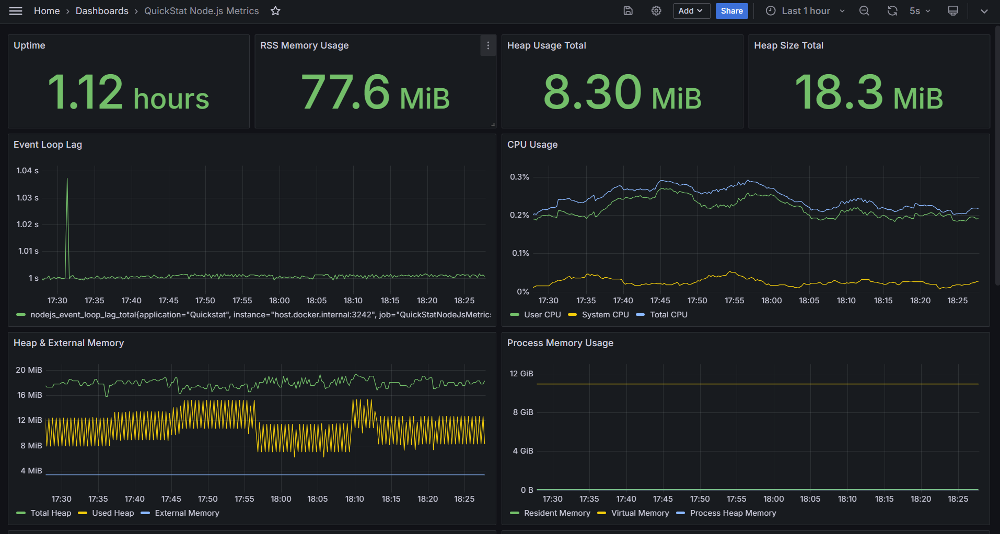
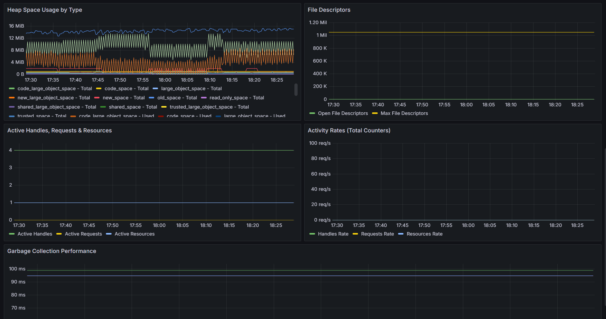

# Node.js Plugin Example

To quickly set up and run the Node.js Plugin example, follow the steps below.

## Grafana Dashboard

The dashboard is located under `./docker/grafana/provisioning/dashboards/nodejs.json`, which also has been published to [Grafana's Dashboard Hub](https://grafana.com/grafana/dashboards/24130).




- **Event Loop Lag**: Monitor the responsiveness of your Node.js application
- **Heap Memory Usage**: Track total and used heap memory
- **CPU Usage**: Monitor user and system CPU consumption
- **Active Handles & Requests**: Track active handles and pending requests
- **Garbage Collection Duration**: Analyze GC performance with percentile distributions

### Clone Repo & Install Dependencies

First, clone the repository to your local machine:

```bash
git clone https://github.com/QuickStat/quickstat.git
```

Next, install the dependencies required for running the example:

```bash
npm i -g pnpm
pnpm install
pnpm run build
```

Pnpm has been used due to the support of workspaces.

### Start Docker

Run the following command to start Prometheus and Grafana:

```bash
cd examples/plugins/nodejs/docker
docker-compose up -d
```

### Build & Start the Example

Navigate to the Node.js plugin example directory and start the Node.js metrics collection:

```bash
cd examples/plugins/nodejs
pnpm start:main
```

### Access the Dashboard

1. **Grafana**: Open your browser and go to [http://localhost:3000](http://localhost:3000)
   - Username: `admin`
   - Password: `admin`
   - Navigate to the "QuickStat Node.js Metrics" dashboard

2. **Prometheus**: You can also view raw metrics at [http://localhost:9090](http://localhost:9090)

3. **Metrics Endpoint**: The raw metrics are available at [http://localhost:3242](http://localhost:3242)

### What You'll See

The example application will:

- Automatically collect Node.js runtime metrics
- Simulate periodic workload to generate interesting metrics
- Show real-time data in Grafana dashboards including:
  - Event loop lag measurements
  - Memory usage patterns
  - CPU utilization
  - Garbage collection performance
  - Active handles and requests

# Disclaimer

The docker-setup exposes some ports to the host machine. If you are planning to use this setup in a production environment, make sure to secure the ports and the services running on them or blocking them.
