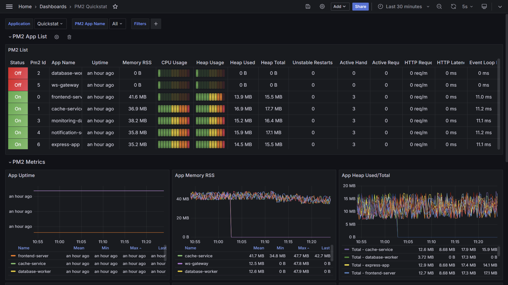
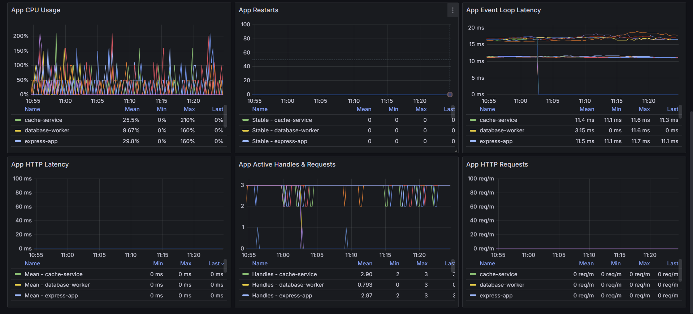
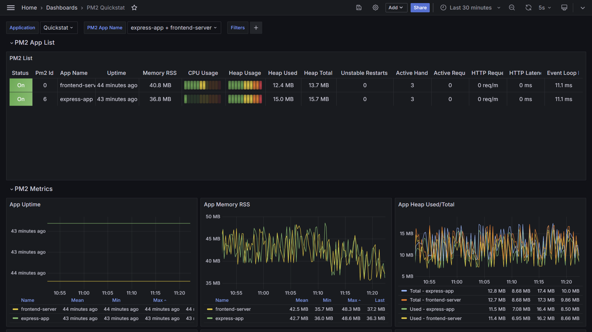
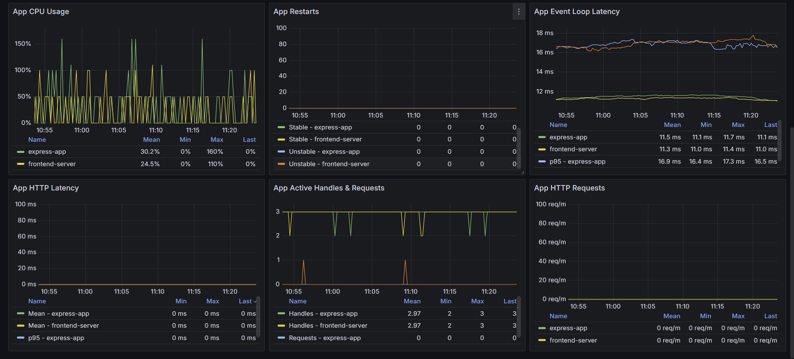

# PM2 Plugin Example

To quickly set up and run the PM2 Plugin example, follow the steps below.

## Grafana Dashboard

The dashboard is located under `./docker/grafana/provisioning/dashboards/pm2.json`, which also has been published to [Grafana's Dashboard Hub](https://grafana.com/grafana/dashboards/20864).

### All Processes




### Processes selected by name




### Clone Repo & Install Dependencies

First, clone the repository to your local machine:

```bash
git clone https://github.com/QuickStat/quickstat.git
```

Next, install the dependencies required for running the example:

```bash
npm i -g pnpm
pnpm install
```

Pnpm has been used to due the support of workspaces.

### Start Docker

Navigate to the PM2 Plugin example directory:

```bash
cd quickstat/examples/plugins/pm2
```

Start Docker by running the following command:

```bash
cd /docker
docker-compose up -d
```

This command will spawn the necessary services required for running the PM2 Plugin example. The services include:

- Prometheus: Exposes the metrics to Grafana
- Grafana: Used for visualizing the metrics

### Start PM2 Metrics Collector

After Docker has been successfully started, you can now start the QuickStat PM2 metrics collector:

```bash
npm run start:main
```

After the application has been started the metrics will be exposed at `http://localhost:3242`, ready for scraping by Prometheus.

For demonstration purposes about ten pm2 processes will be spawned. You can stop or kill them to check it on the Grafana dashboard, which updates every 5 seconds.

# Disclaimer

The docker-setup exposes some ports to the host machine. If you are planning to use this setup in a production environment, make sure to secure the ports and the services running on them or blocking them.
